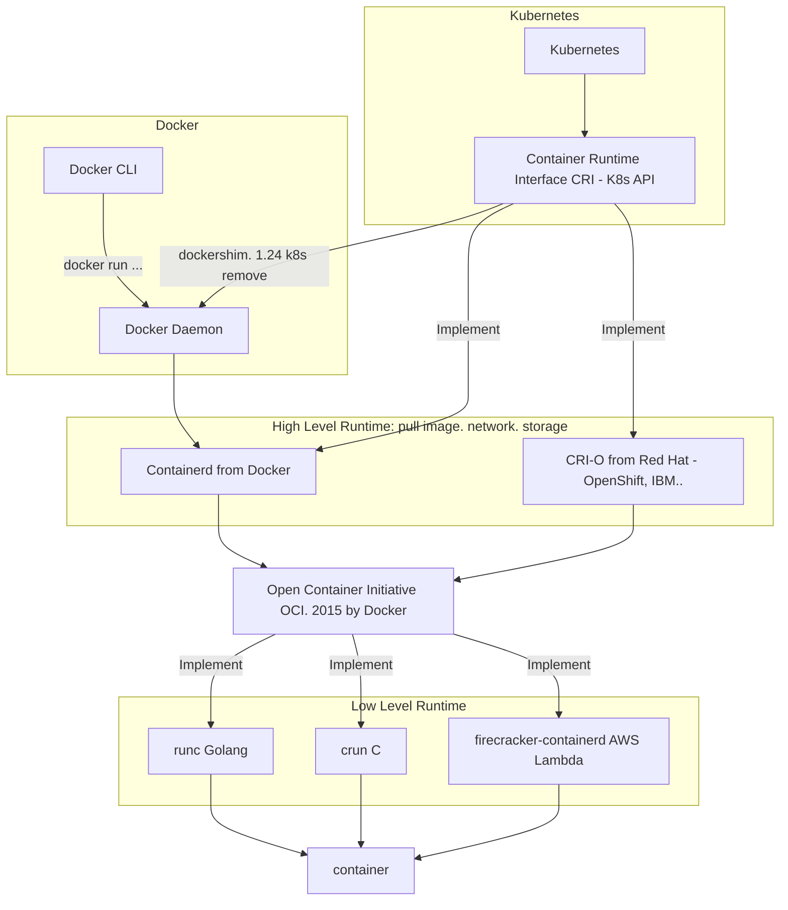

Some initial research about k8s.

1. Relationship between containerd and docker

- Low level runtime is currently mainly runc
- High level runtime is currently mainly using containerd

- k8s is removing docker runtime from version 1.24
- removing doesn't mean having to change docker-formatted containers (meaning dockerfile standard is still kept)
- both containerd and CRI-O can run docker-formatted and OCI-formatted images, the difference is they can run without needing to use docker commands from docker daemon

- [detailed review article](https://vineetcic.medium.com/the-differences-between-docker-containerd-cri-o-and-runc-a93ae4c9fdac)

2. Container Component Model

Simply understand containers: group processes together to isolate

History of container formation:

- don't want to waste effort creating another VM to make everything completely independent
- want to manage independent environments more lightly (direct interaction)

Distinguishing virtualization and Container:
- virtualization works with VMs, containers work directly with processes

Docker in the overall picture of containers:

Previously, Docker included 3 parts:
- Managing images, network, volume (now it shifts to only managing this part - parallel in function and responsibility with K8S)
- container manager -> shifted to using containerd (CNCF)
- container runtime -> shifted to runc (CNCF)

I have this open question for you: why can't systemd run in containers?

3. Components of k8s

I'll introduce a basic model of K8S

Will include the following basic components:

- Runtime (containerd)
- kubelet: runs on nodes
- Master: etcd (database - stores cluster information), scheduler, api-server, controller
- HA for api-server: can use nginx or haproxy, combined with keepalived
- Kube-proxy

Details about component interactions, network, volume... I'll see you in the distant future :D

